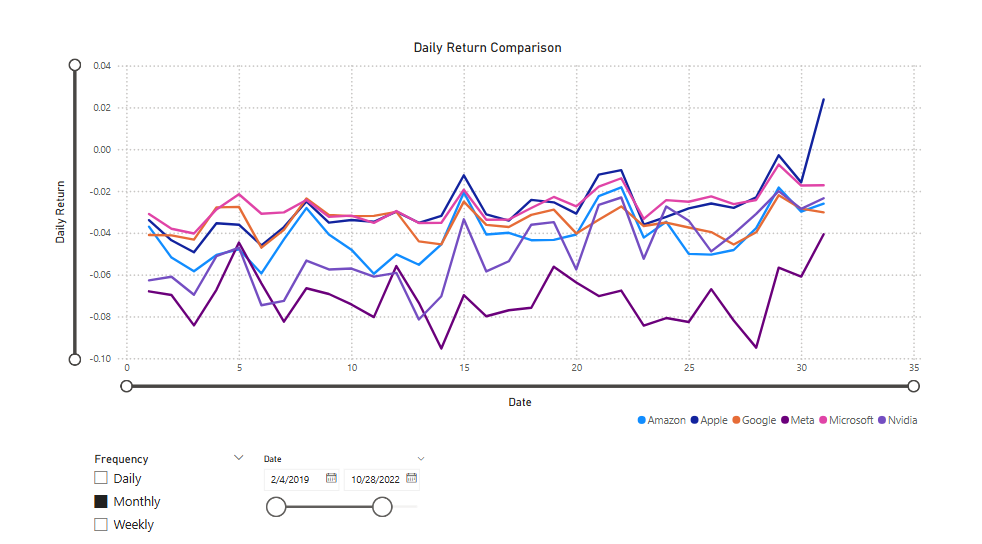
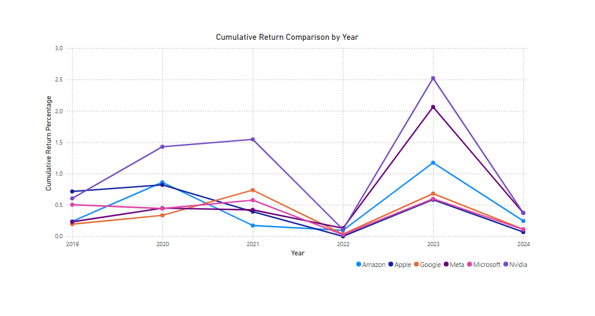
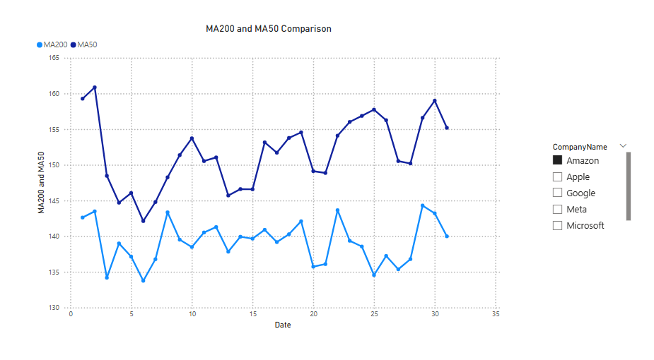
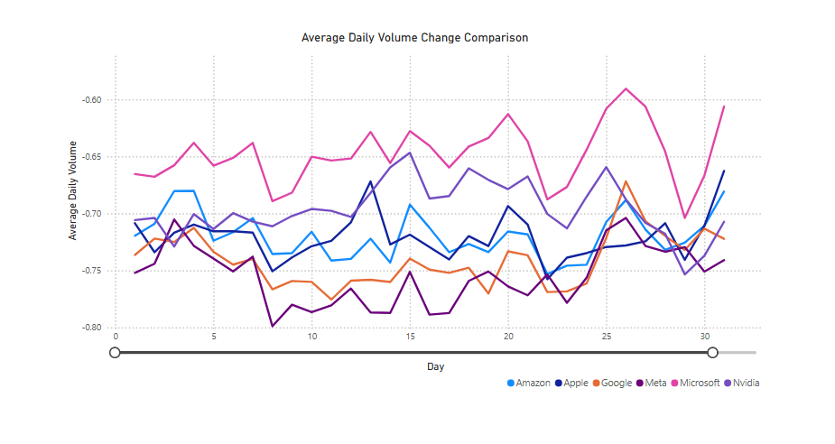
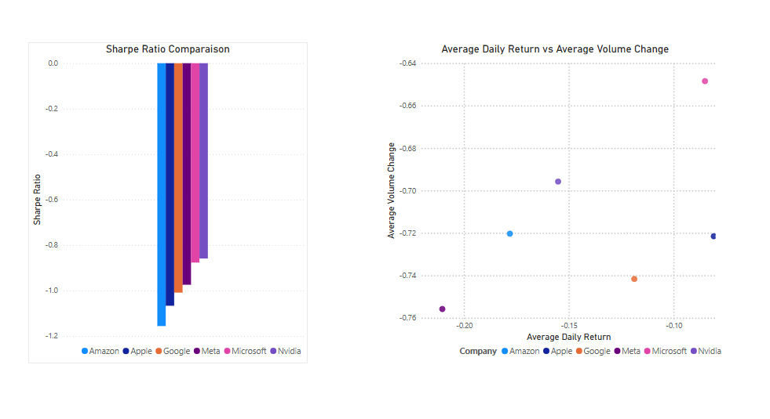
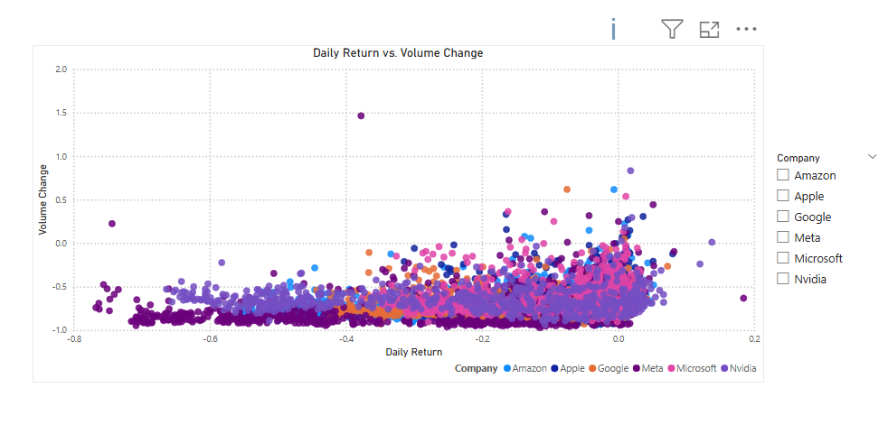
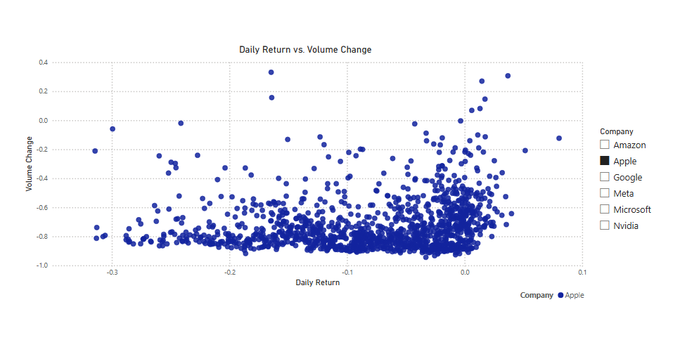
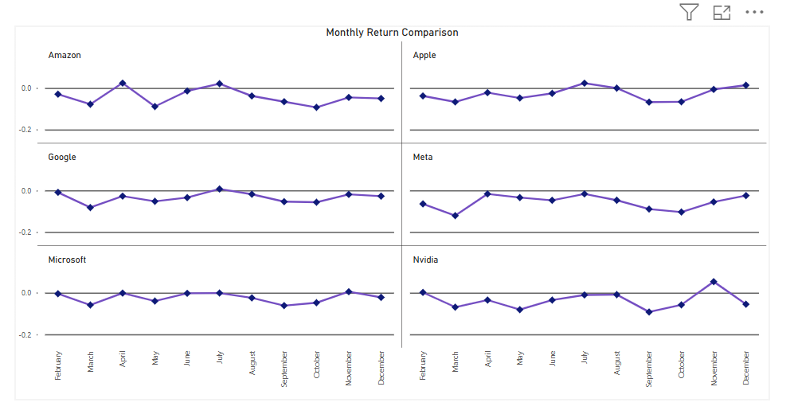

# stock-market-powerbi-dashboard

This project aims to provide a stock market analysis of major tech companies using the following [Kaggle dataset](https://www.kaggle.com/datasets/saketk511/2019-2024-us-stock-market-data). 

Visuals representing.... and DAX calculations....

The screenshots of the individal report pages and the full dashboard can be seen below:

# Repository Overview
This repository contains a [PowerBi file](stockmarket.pbix) used to create the report and dashboard above, screenshots of each report page and a [screenshot of the full dashboard](Full%20Dashboard.png).

